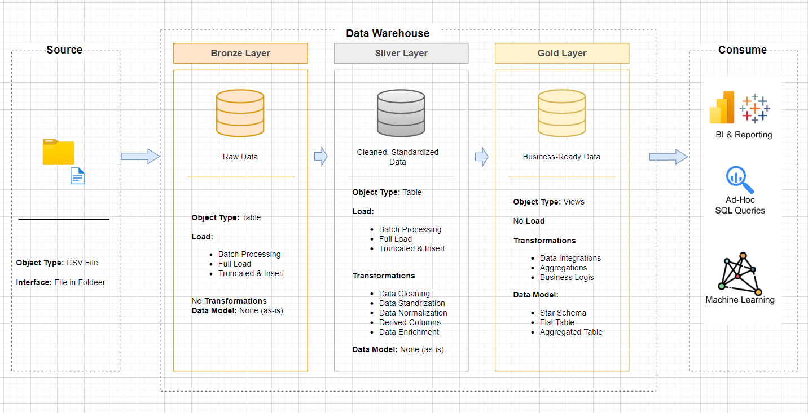
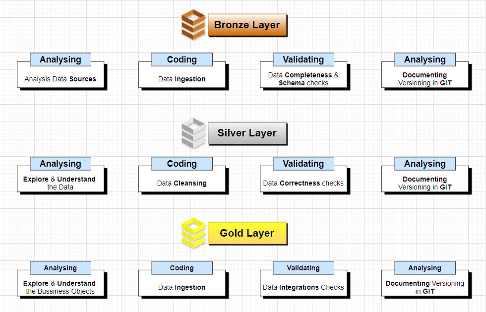
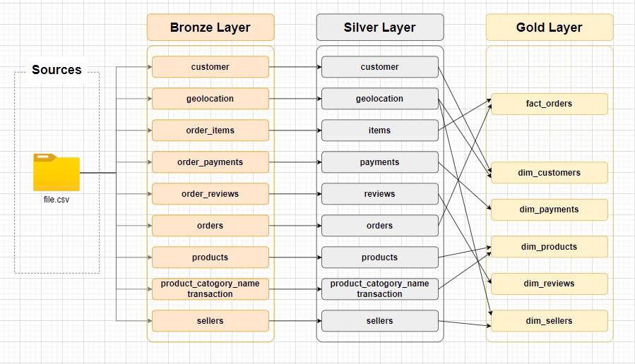
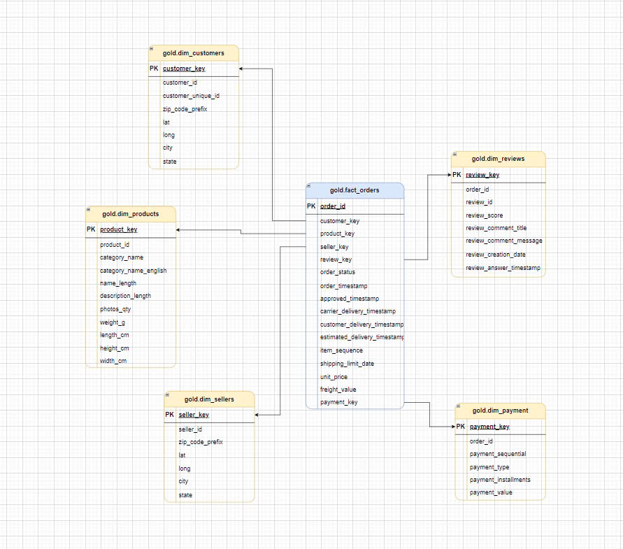

# Olist's Data Warehouse

## Overview
This project develops a **Data Warehouse** based on a **Star Schema** to facilitate business analytics using Olist's e-commerce dataset. The warehouse is structured into three layers (Bronze, Silver, Gold) to ensure data integrity, consistency, and readiness for reporting and analysis.

### Objectives
- Provide a centralized data platform for analyzing key business metrics such as revenue, delivery performance, and customer reviews.
- Optimize data querying for integration with Business Intelligence (BI) tools.
- Ensure data quality through integrity and consistency checks.

## Data Source
The data for this warehouse is sourced from the **Olist E-commerce Dataset**, which contains information about orders, products, customers, sellers, payments, and reviews from an Brazilian e-commerce platform.  
- **Dataset Link**: [Olist Dataset on Kaggle](https://www.kaggle.com/datasets/olistbr/brazilian-ecommerce)  
- **License**: Provided under the CC BY-NC-SA 4.0 license by Olist.

## Data Warehouse Architecture

*The overall architecture of the data warehouse, illustrating the flow from raw data to analytics-ready data across Bronze, Silver, and Gold layers.*

### Data Layers

*Detailed view of the Bronze, Silver, and Gold layers, showcasing the tables and transformations at each stage.*

1. **Bronze Layer**: 
   - Contains raw data sourced from Olist, including orders, order items, customers, products, sellers, payments, and reviews.
   - Purpose: Store unprocessed source data.

2. **Silver Layer**: 
   - Cleansed, normalized, and pre-processed data from the Bronze Layer.
   - Tables: `silver.orders`, `silver.order_items`, `silver.customers`, `silver.products`, `silver.sellers`, `silver.order_payments`, `silver.order_reviews`, `silver.geolocation`, `silver.product_category_name_translation`.
   - Purpose: Prepare data for the Gold Layer.

3. **Gold Layer**: 
   - Organized into a **Star Schema** for business analytics.
   - **Fact Table**: `gold.fact_orders`
     - Combines data from `silver.orders` and `silver.order_items`.
     - Metrics: `unit_price`, `freight_value`.
     - Foreign Keys: `customer_key`, `product_key`, `seller_key`, `payment_key`, `review_key`.
   - **Dimension Tables**:
     - `gold.dim_customers`: Customer details with geolocation data.
     - `gold.dim_products`: Product details with English-translated category names.
     - `gold.dim_sellers`: Seller details with geolocation data.
     - `gold.dim_payments`: Payment details linked to orders.
     - `gold.dim_reviews`: Review details linked to orders.
   - Purpose: Deliver analytics-ready data for reporting.

### Data Flow

*Flowchart depicting the ETL process from source data to the final Gold Layer, including data loading and transformation steps.*

### Data Model

*Star Schema representation of the Gold Layer, showing the relationships between the fact table (`fact_orders`) and dimension tables.*